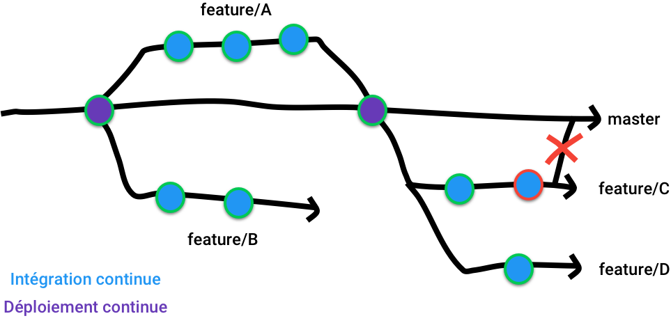

# Intégration continue
Ça passe ou ça casse

---

## L'intégration continue

Technique permettant de vérifier la qualité du code avant son intégration dans une application.

---

> Et le déploiement continu, c'est pareil ?

---

## Le déploiement continu

Technique permettant de déployer automatiquement le nouveau code d'une application dans un ou plusieurs environnement.

<p style="color: red;">⚠️ Il ne faut pas confondre la CI et la CD mais les deux sont complémentaires</p>

---

## Les environnements

 * Développement
 * Acceptance
 * Pré-production
 * Production

---

## En pratique



---

## Les plateformes de CI/CD

 * Github Actions
 * Gitlab CI
 * Circle CI
 * Travis CI
 * Jenkins
 * ...

---

> On va utiliser laquelle, nous ?

---

# Github Actions

.github/workflows/continuous-integration.yml

```yaml
name: Continuous integration
on: [push]
jobs:
  test:
    runs-on: ubuntu-latest
    steps:
      - name: Check out repository code
        uses: actions/checkout@v2
      - name: Use Node.js
        uses: actions/setup-node@v2
        with:
          node-version: '14.x'
      - name: Install dependencies
        run: npm install
      - name: Run tests
        run: npm run test
```

---

## Le mouvement DevOps

 * Concaténation de *development* et de *operations* 
 * Un être mi-ops, mi-dev et re mi-ops derrière
 * Accompagne l'application du code à la livraison
