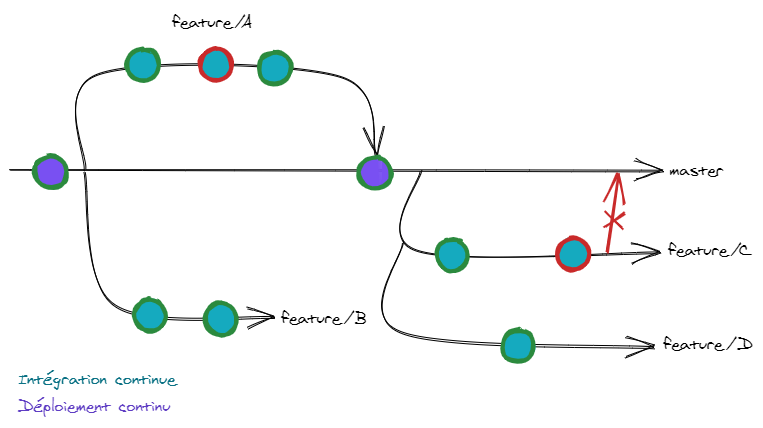

# Intégration continue
Ça passe ou ça casse

---

## L'intégration continue

Technique permettant de vérifier la qualité du code avant son intégration dans une application.

---

> Et le déploiement continu, c'est pareil ?

---

## Le déploiement continu

Technique permettant de déployer automatiquement le nouveau code d'une application dans un ou plusieurs environnement.

<p style="color: red;">⚠️ Il ne faut pas confondre la CI et la CD mais les deux sont complémentaires</p>

---

## Les environnements

 * Développement
 * Acceptance
 * Pré-production
 * Production

---

## En pratique



---

## Les plateformes de CI/CD

 * Gitlab CI
 * Circle CI
 * Travis CI
 * Jenkins
 * ...

---

> On va utiliser laquelle, nous ?

---

# Gitlab CI

```yaml
# fichier .gitlab-ci.yml placé à la racine du dépôt

# L'image Docker sur laquelle on se base
image: node:latest 

# Exécuté avant chaque job
before_script:
    - npm install

# Définition des différents stages
stages:
    - test
    - deploy

# Définition d'un job du stage test
test:
    stage: test
    script: npm run test # On lance les tests

# Définition d'un job du stage deploy
deploy:
    stage: deploy
    script: npm run deploy # On déploie l'application
```

---

## Le mouvement DevOps

 * Concaténation de *development* et de *operations* 
 * Un être mi-ops, mi-dev et re mi-ops derrière
 * Accompagne l'application du code à la livraison
