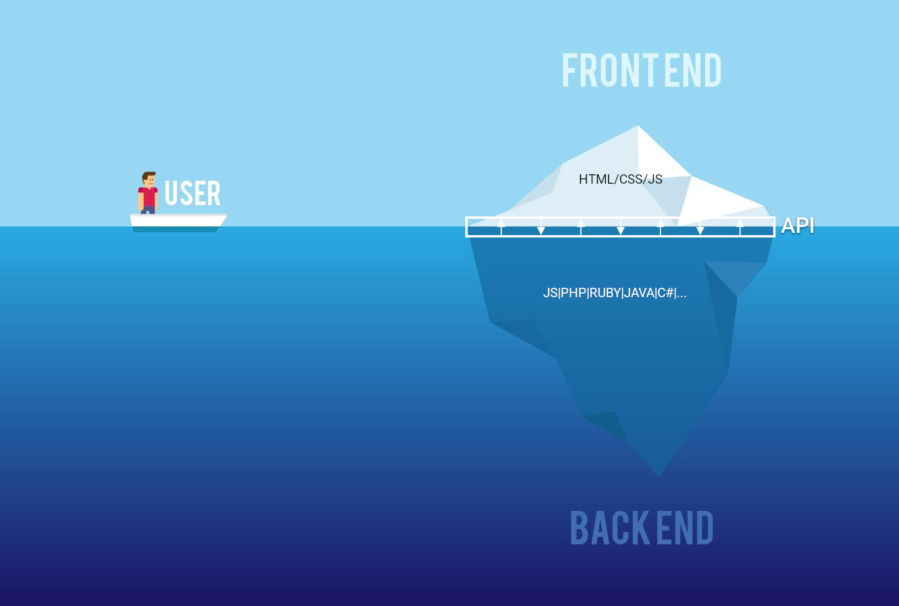

# Le developpement web
**GET** /cours HTTP/1.1

---

## Une application web 

 * Ca répond à des requêtes HTTP
 * C'est accessible via internet (pas toujours => intranet)
 * C'est utilisable avec un navigateur (pas toujours => API)

---


<small style="text-align: right;">www.designquote.net</small>


---

## Une requête HTTP

```HTTP
GET /gp/cart/view.html?ref_=nav_cart
Host: www.amazon.fr
Accept: text/html
User-Agent: Chrome/27.0.1453.110
```

---


## Les verbes HTTP

| Verbe     | Définition                    |
| --------- | ----------------------------- |
| GET       | Lecture d'une ressource       |
| POST      | Création d'une ressources     |
| PUT       | Mise à jour d'une ressource   |
| DELETE    | Suppression d'une ressource   |

---

## Les headers HTTP


| Headers       | Définition                    |
| ------------- | ----------------------------- |
| Accept        | Format des données attendues  |
| Content-Type  | Format des données envoyées   |
| Cache-Control | Politique de cache            |
| Authorization | Token d'authentification      |
| Origin        | L'origine de la consultation  |

---

## La norme REST

 * Se base sur les url, les verbes et les headers
 * Permet de faire une API facilement utilisable
 * Simple à comprendre

---

> Pourtant ça à l'air compliqué...

---

## Récupérer toutes les pizzas

```HTTP
GET /pizzas
Host: www.pizzima.fr
Accept: application/json
```

```json
[
    {id: 1, name: "Classique jambon" },
    {id: 2, name: "Bellachô" },
    {id: 3, name: "Super veggie" },
    ...
]
```

---

## Récupérer la pizza n°42

```HTTP
GET /pizzas/42
Host: www.pizzima.fr
Accept: application/json
```

```json
{
    id: 42, 
    name: "4 Fromages",
}
```

---

## Ajouter une pizza

```HTTP
POST /pizzas
Host: www.pizzima.fr
Accept: application/json

{
    name: "Pepperoni",
    description: "Une pizza au pepperoni"
}
```

---

## Modifier la pizza n°42

```HTTP
PUT /pizzas/42
Host: www.pizzima.fr
Accept: application/json

{
    name: "5 Fromages",
    description: "Une pizza au fromage"
}
```

---

## Supprimer la pizza n°42

```HTTP
DELETE /pizzas/42
Host: www.pizzima.fr
Accept: application/json
```


---

## Récupérer les ingrédients de la pizza n°42

```HTTP
GET /pizzas/42/ingredients
Host: www.pizzima.fr
Accept: application/json
```

---

> Ok, mais en Javascript, on fait ça comment ?

---

## ExpressJS

```javascript
import pizzaService from "../services/pizzaService"

app.get('/pizzas', (req, res) => {
    const pizzas = pizzaService.findAll()
    res.json(pizzas)
})

app.post('/pizzas/:id', (req, res) => {
    pizzaService.update(req.params.id, req.body)
    res.sendStatus(200)
})

app.delete('/pizzas/:id', (req, res) => {
    pizzaService.delete(req.params.id)
    res.sendStatus(200)
})
```
