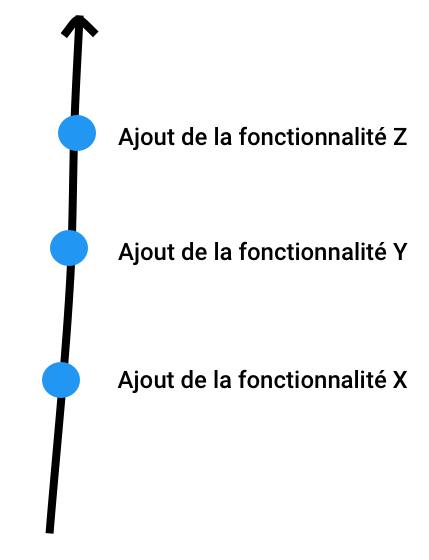
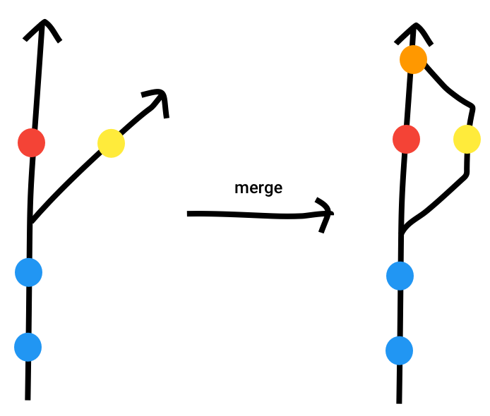
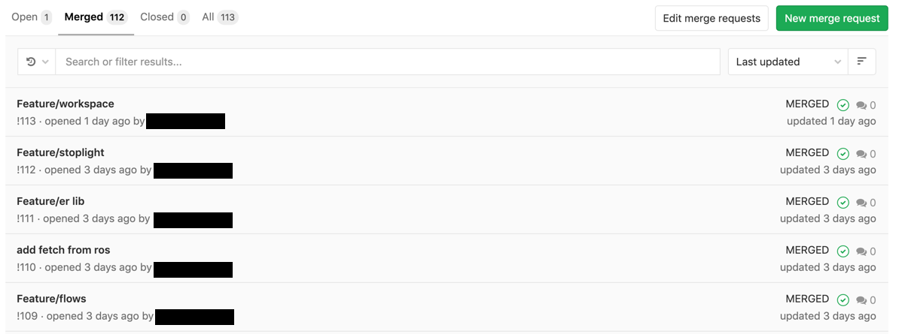

# Git
fichier.old.older.oldest.js

---

## Un peu d'histoire

 * Logiciel de gestion de version (vcs)
 * Créé par Linus Torvalds en 2005
 * Le plus utilisé (+12 millions d'utilisateurs)
 * Permet :
    * La collaboration
    * L'audit du code
    * Le retour en arrière
    * La gestion de versions

---

## Les alternatives

 * SubVersioN (SVN)
 * Mercurial
 * Bazaar
 * ...

---

> Comment ça marche ?

---

## Initialiser Git

```shell
$ mkdir projet
$ cd projet
$ git init
```

---

## Soumettre des modifications

```shell
$ echo 'console.log("Hello World")' > hello.js
$ git status
Untracked files:
    hello.js

$ git add hello.js
$ git status
Changes to be committed:
    new file:   hello.js

$ git commit -m "Création du fichier hello.js"
$ git status
nothing to commit, working tree clean
```

---



---

## Afficher les modifications

```shell
$ echo 'console.log("Hello all")' >> hello.js
$ git diff
 console.log("Hello World")
+console.log("Hello all")
```

---

## Créer une branche

```shell
$ git branch feature/ajouter-un-bouton
$ git branch
  feature/ajouter-un-bouton
* master
$ git checkout feature/ajouter-un-bouton
Switched to branch 'feature/ajouter-un-bouton'
$ git branch
* feature/ajouter-un-bouton
  master
```

---


---

## Mettre à jour une branche

```shell
$ git rebase master
```


---

## Fusionner deux branches

```shell
$ git checkout master
$ git merge feature/ajouter-un-bouton
```


---

## Se synchroniser avec un dépôt distant

Récupérer un projet
```shell
$ git clone https://example.com/projet.git
```

Récupérer les modifications
```shell
$ git pull origin master
```

Envoyer ses modifications
```shell
$ git push origin master
```

---

## Où héberger son dépôt

 * Github
 * **Gitlab**
 * Bitbucket
 * ...

---

## Git dans la vraie vie


---

## Les pull requests


