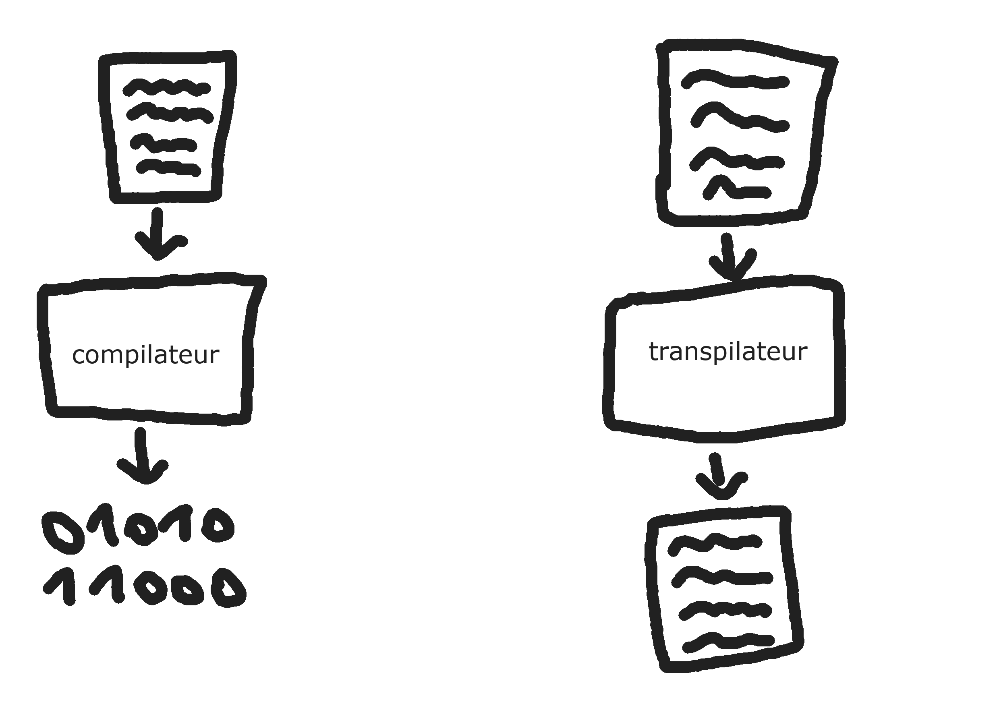

# Javascript
console.log("Hello World !")

---

## Javascript en quelques mots

 * Langage interprété
 * Orienté objet, impératif, fonctionnel
 * Créé le 4 decembre 1995
 * Standardisé sous le nom d'ECMAScript
 * N'a **AUCUN** rapport avec Java !!!

---

## Pourquoi JavaScript?

 * Simple à utiliser/apprendre
 * Permet de faire du front, du back, des scripts, des app mobiles, de l'IOT, ...
 * Populaire (1er du classement Stackoverflow Survey)
 => Très grosse communauté
 * Parce que c'est moi qui décide

--- 

## l'ECMAScript

 * Avant ES5, une version tous les 3-5ans
 * A partir d'ES6 (ES2015), une version tous les ans
 * Tous les navigateurs modernes supportent ES5
 * Quelques navigateurs supportent ES6
 * Aujourd'hui ES2019

---

> Comment utiliser les dernières versions de JS ?

---

## les transpilleurs

 * Le plus utilisé est BabelJS
 * Permet de transformer un langage en un autre
 * Ne pas confondre avec un compilateur
 * ES2019 => ES5, plus de soucis de compatibilité !
 * Les polyfills permettent également une meilleure rétrocompatibilité

---



---

## Quelques langages

 * TypeScript
 * ReasonML
 * CoffeeScript
 * Kotlin
 * et pleins d'autres...

---

> Et ça ressemble à quoi ?

---

```javascript
// Déclarer une variable
let var1 = "toto"
let var2 = 2
let var3 = 3.5

var1 = 5
var1 = "tutu"

// Déclarer une constante
const const1 = "titi"
// const1 = "tata" /!\ IMPOSSIBLE
```

---

## Les promesses

---

## La programmation fonctionnelle

---

## Nodes JS
