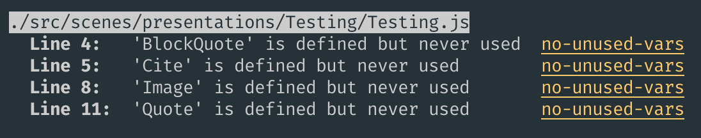

# Les tests
Tester, c'est douter

---

## Les types de tests

 * Static analysis / Linting
 * Unit testing
 * Integration testing
 * End-to-End (e2e) testing

---

## Static analysis / Linting

 * Analyse du code sans l'exécuter
 * Détecte les erreurs de programmation comme :
    * Les variables non utilisées
    * Les imports manquants
    * ...
 * Intégré aux IDEs pour un feedback immédiat
 * Eslint => le plus utilisé en Javascript

---



---

## Unit testing

 * Test d'une portion ou unité d'une application
 * On va tester les fonctions de manière isolées
 * Ecrire des fonctions pures => plus simple à tester

---

```javascript
function add(a, b) {
    return a + b
}

describe("add", () => {
    test("should add two numbers", () => {
        expect(add(1, 1)).toEqual(2)
    })

    test("should add two negatives numbers", () => {
        expect(add(-1, -1)).toEqual(-2)
    })
})
```

---

## Integration testing

 * Test d'une fonctionnalité
 * Dans une app web => test d'une route
 * On va tester l'intéraction entre plusieurs fonctions

---

```javascript
describe("find all cars", () => {
    test("should respond with a 200", () => {
        return request(app)
            .get("/cars")
            .expect("Content-Type", "application/json")
            .expect(200)
    })
})
```

---

## Test d'integration vs test unitaire


---


---

## End-to-End testing

 * Test de l'interface
 * On va simuler des scénarios utilisateur
 * Les scénarios vont cliquer, saisir, scroller dans la page

---

## Et pleins d'autres encore 

 * Regression testing
 * Monkey testing
 * Canary testing
 * ...

---

## Test-driven development

On test puis on code de façon itérative

```markdown
1. écrire un seul test qui décrit une partie du problème à résoudre
2. écrire juste assez de code pour que le test réussisse
3. vérifier que le test passe, ainsi que les autres tests existants
4. goto 1
```

---

## Quelques conseils

 * Ecrire des fonctions courtes (10-15 lignes max)
 * Ecrire des fonctions pures
 * Penser à la testabilité de la fonction avant de l'écrire

---

> Et si on a des effets de bords, on test pas ?

---

## Les mocks

C'est une fonction de remplacement utilisé lors des tests.
Très utile pour enlever les effets de bords lors des tests.

```javascript
// foo.js
export default function() {
  return Math.random()
};

// foo.test.js
import foo from "./foo"

// Mock l'ensemble des fonctions du module
jest.mock('./foo');

foo();
// -> undefined

// Change l'implémentation de la fonction
foo.mockImplementation(() => 42);
foo();
// -> 42
```
